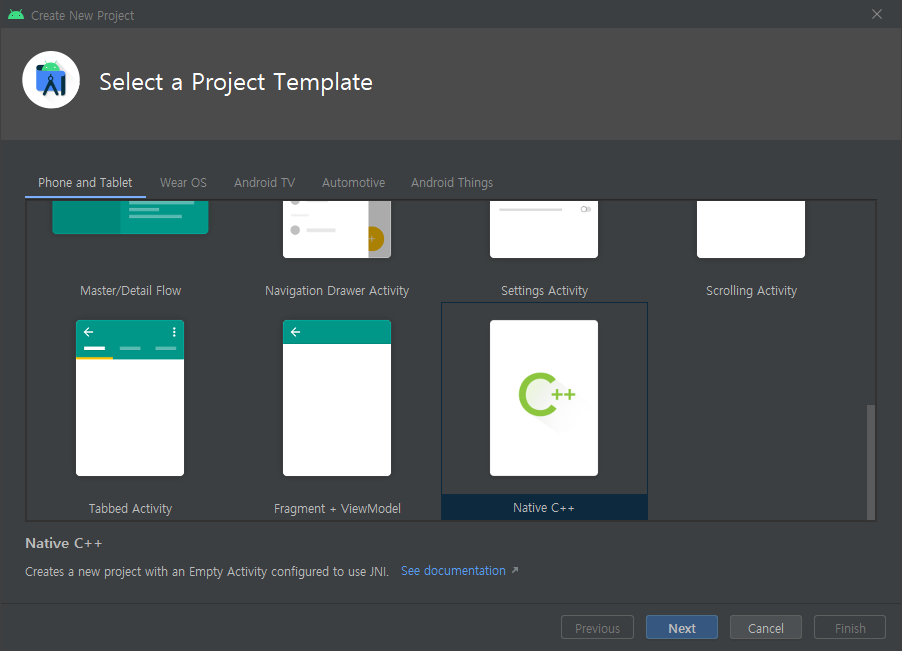
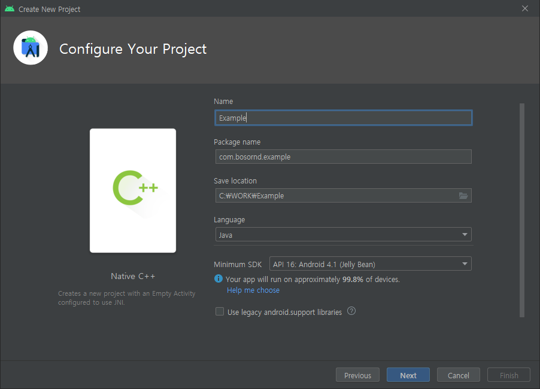
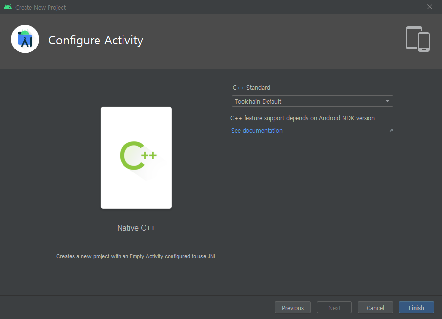
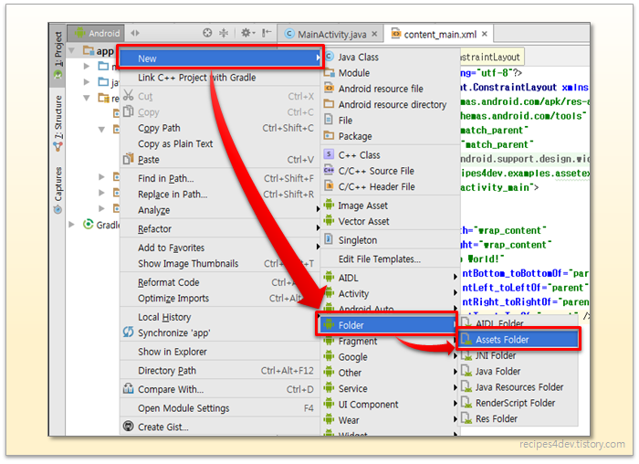

# bangtal.android

방탈 라이브러리로 안드로이드 게임을 만드는 방법은 다음과 같습니다.

1. 먼저 Android Studio로 "Native C++" Project를 생성합니다.




2. app/build.gradle의 dependencies에 다음을 추가합니다.
```
    debugImplementation fileTree(dir: System.getenv('BANGTAL_HOME') + '/lib/android/debug', include: ['*.aar'])
    releaseImplementation fileTree(dir: System.getenv('BANGTAL_HOME') + '/lib/android/release', include: ['*.aar'])
```

3. app/src/main/cpp/CMakeLists.txt에 다음을 추가합니다.
```
    target_include_directories(native-lib PUBLIC $ENV{BANGTAL_HOME}/include/)
    target_link_libraries(native-lib $ENV{BANGTAL_HOME}/lib/android/${CMAKE_BUILD_TYPE}/${CMAKE_ANDROID_ARCH_ABI}/libBangtal.so)
```

4. app/src/main/AndroidManifest.xml을 다음과 같이 수정합니다.
```
<?xml version="1.0" encoding="utf-8"?>
<manifest xmlns:android="http://schemas.android.com/apk/res/android"
    package="com.bosornd.example">

    <uses-permission android:name="android.permission.INTERNET"/>
    <uses-feature android:glEsVersion="0x00020000" />

    <application
        android:allowBackup="true"
        android:icon="@mipmap/ic_launcher"
        android:label="@string/app_name"
        android:roundIcon="@mipmap/ic_launcher_round">
        <activity
            android:name="com.bosornd.bangtal.AppActivity"
            android:screenOrientation="landscape"
            android:configChanges="orientation|keyboardHidden|screenSize"
            android:label="@string/app_name"
            android:theme="@android:style/Theme.NoTitleBar.Fullscreen"
            android:launchMode="singleTask"
            android:taskAffinity="">
            <intent-filter>
                <action android:name="android.intent.action.MAIN" />
                <category android:name="android.intent.category.LAUNCHER" />
            </intent-filter>
        </activity>
    </application>
</manifest>
```

`<uses>`를 추가하고 `<activity>`를 교체하면 됩니다.
    
5. 게임 프로그램은 app/src/main/cpp/native-lib.cpp에 작성하면 됩니다.
6. 게임에 사용되는 이미지 등의 리소스는 app/src/main/assets 폴더에 넣으면 됩니다.

7. 안드로이드 개발에서 주의할 점은 다음과 같습니다.
   1. Bangtal library에서 main() 함수를 호출할 때 사용하므로, 라이브러리 이름(native-lib)을 바꾸면 안됩니다.
   2. main() 함수가 반환되고 게임이 동작하므로 람다 함수에서 main() 함수의 지역변수를 사용하면 안됩니다.
